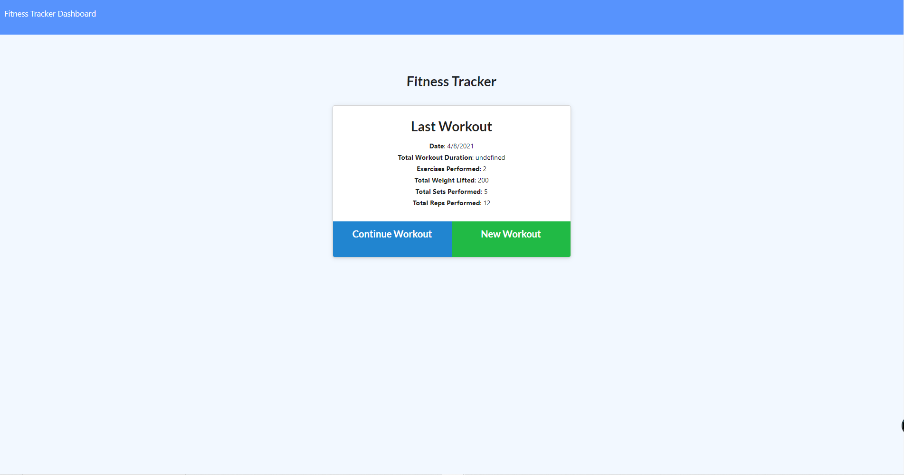
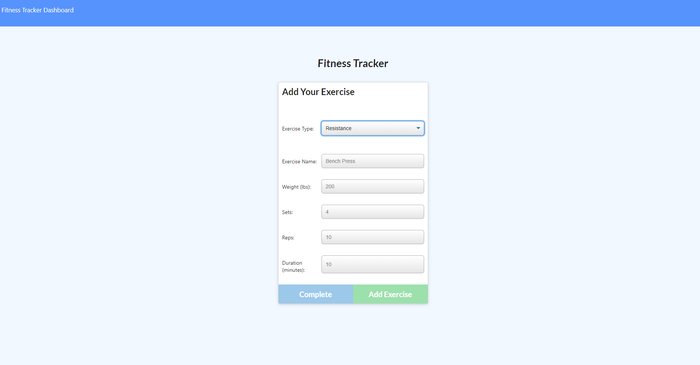
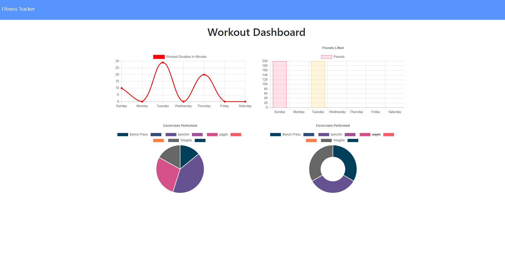

# Workout-Tracker
      

## Description
    An application that can be used to track workouts and exercises over time- using mongodb and manifests and service worker to enable offline functioality. 

## Table of Content
   
* [Installation](#installation)
     
* [Usage](#usage)

* [Future Direction](#Future-Direction)

* [Live Screenshots](#Live-Screenshots)

* [Contributions](#Contributions)
       
* [Credits](#credits)
    
* [License](#license)
     
  

    
  
## Installation
1.  For local deployment - install node, run code "npm i" then "npm start" 
2.  Alternate Method - Click on this [Deployed Link](https://mysterious-ridge-11491.herokuapp.com/)
  
## Usage
    This application takes in users input; selecting either to continue a previosus workout or to start a new one. The user can choose the type of exercise and then add the figures beind their exercise. The user can add multiple exercises before choosing to complete workout. The user can select the dashboard in the top left corner to view graphs of their workout progress. 

    The data being inputted by the user is stored in a mongoose database, API calls are made to pull that information and display them. This web application aslo includes functionality for installation and offline functionality - try it out if youd like! 

## Future Direction
* Fixing duration tracker.
* Properly implementing seeder.
* Allowing user to put in workouts for specific dates.

### Live Screenshots

### Contributions 

    This application has an MIT license and is completely open to open source contribution! Feel free to fork and enhance the functionality and add features if you would like! 

### Changelog
    Version: 1.0: First Release 
    
## Credits
    N/A
    
## License
     MIT
      
    
## Questions
* Github : [Ezkenneth](github.com/Ezkenneth)
* E-mail : Reach me at - kennethjoeezigbo@gmail.com